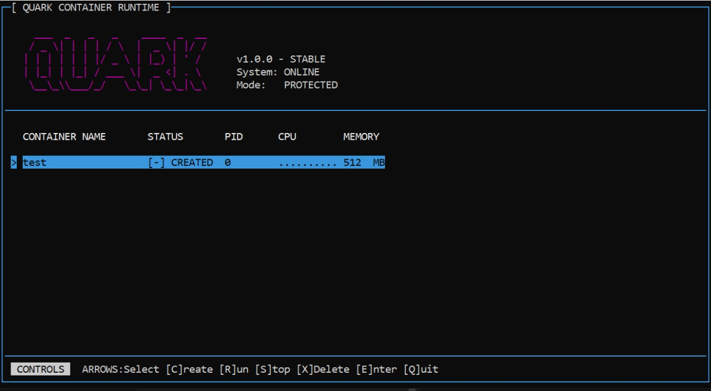

# Quark Container Runtime 🚀



**Quark** is a lightweight, zero-dependency container runtime written in C. It demonstrates the core principles of containerization (Namespaces, Cgroups, Chroot) in a single, readable codebase.

Think of it as a "Mini Docker" that you can build and run in seconds.

## ✨ Features

*   **Process Isolation**: Uses Linux Namespaces (`PID`, `UTS`, `IPC`, `MNT`) to create isolated environments.
*   **Resource Control**: Limits CPU and Memory usage via Cgroups (v1 & v2).
*   **Filesystem Isolation**: Uses `chroot` and **Bind Mounts** to provide a full Linux rootfs.
*   **Interactive TUI**: A "Hacker-style" ncurses dashboard to manage containers.
*   **Zero Dependencies**: A single C file. No daemons, no Go runtime, no complex setup.

## 🛠️ Installation

### Prerequisites
```

### 4. Monitoring
Launch the TUI dashboard to view real-time statistics.
```bash
sudo ./quark monitor
```

## Architecture
Quark uses the `clone()` system call to create new processes in separate namespaces:
- **PID Namespace**: Process isolation.
- **Mount Namespace**: Filesystem isolation (private `/tmp`, `/proc`).
- **Network Namespace**: (Planned) Network isolation.
- **Cgroups**: Resource constraints (CPU/Memory).

## License
MIT License
